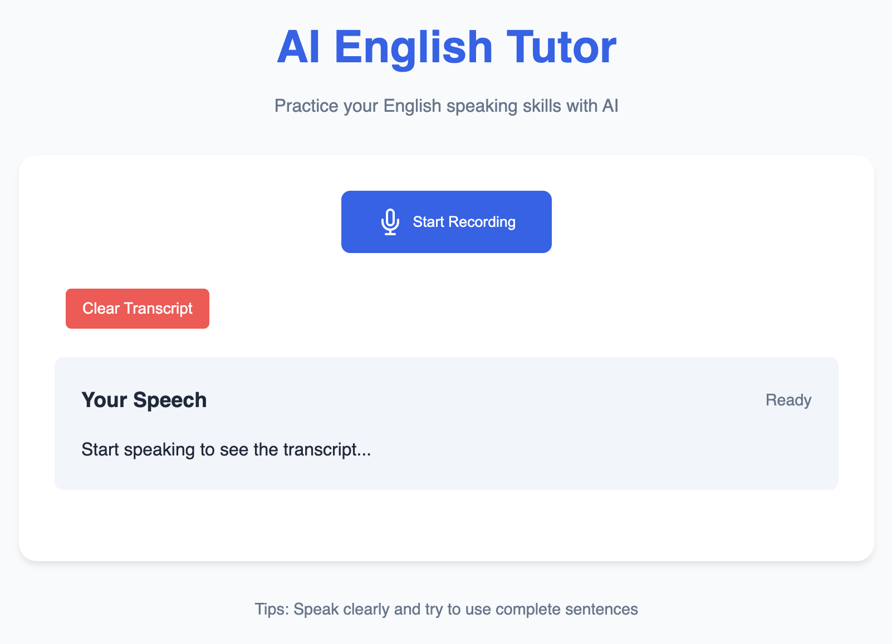

# This repository is my public repository of an existing project [SpeakingAI](https://kutaykoray.com/)
This repository contains the source code for a fully operational project. Due to security and privacy considerations, the complete project—including API keys and workflow configurations cannot be shared publicly. Consequently, this repository focuses solely on the codebase, omitting sensitive information.

**Note**: This project is fully developed, deployed, and managed by me. It runs on my private server with all security and privacy measures in place, ensuring a secure and efficient operation. (Since the server is located in my home, I occasionally turn it off, which may cause temporary accessibility issues.)

# 👩‍🏫 Your AI friend, helps you practice on your speaking

[](https://react.dev/)
[](https://fastapi.tiangolo.com/)

AI English Tutor is a React-based language learning application that helps users practice spoken English using speech recognition and text-to-speech technologies, powered by AI-driven feedback.



## Features ✨

- **Real-time Speech-to-Text** conversion using Web Speech API
- **AI-Powered Feedback** with grammar/vocabulary suggestions
- **Interactive Voice Responses** via text-to-speech
- **Mobile-First Design** with PWA support

## Technologies Used 🛠️

- React (JavaScript)
- FastAPI (Python)
- AI Service Integration (OpenAI)
- Responsive Web Design

## Prerequisites 📋

- API keys for AI services

## Installation And Running Locally ⚙️

```bash
git clone https://github.com/KutayKoray/Speaking_AI.git
cd Speaking_AI
npm install
cd ai_service
pip install -r requirements.txt
vim conf.py # Add your API key
uvicorn ai_service:app --reload --port 8000
cd ../english-app
npm start
```

## Also you can try it on my website 🚀

[AI English Tutor](https://kutaykoray.com)
